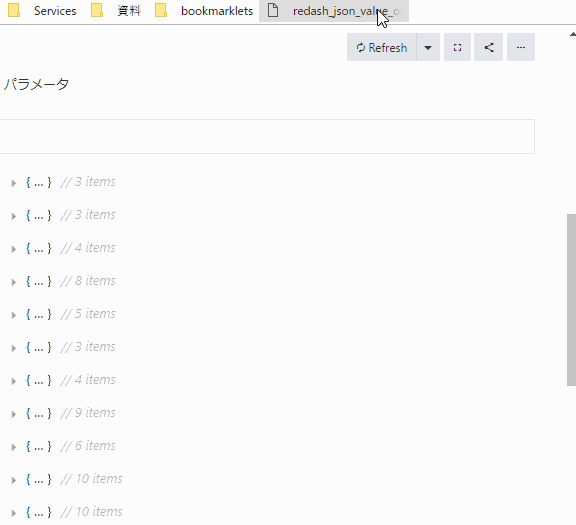

# Bookmarklet

## Re:dash json valueの一括展開

```
javascript:(function(){ const s = document.createElement('script'); s.src = 'https://rawgithub.com/swfz/bookmarklets/master/bookmarklets/redash_json_value_open.js'; document.body.appendChild(s); })();
```



# development

```
thin start --ssl -R app.ru
```

サーバへアクセスするとこのREADMEのホストをプライベートIPに変えたものが出力されるのでそれをブックマークに登録して開発する

